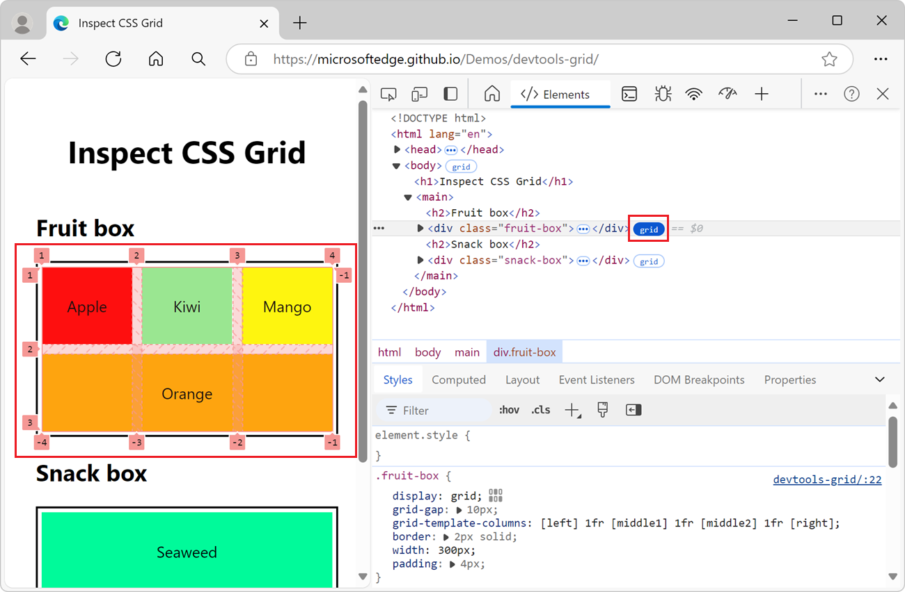
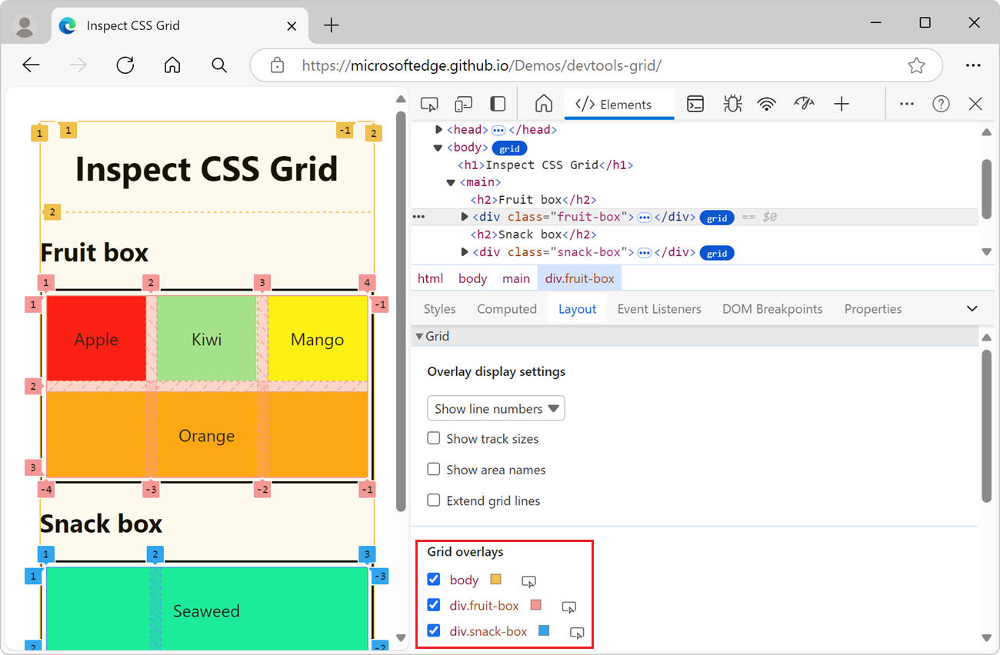
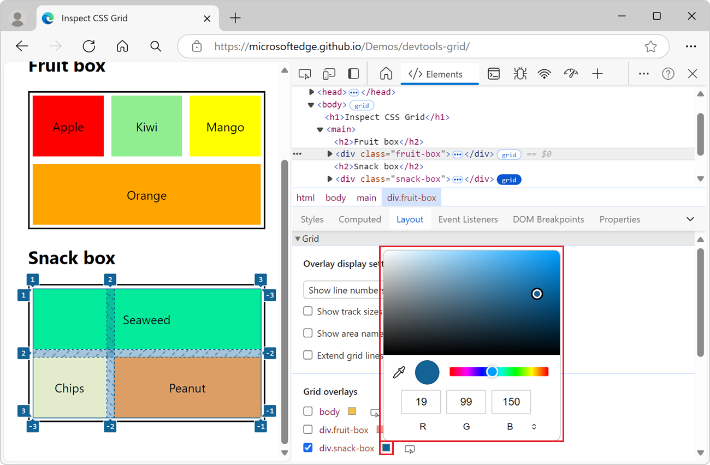
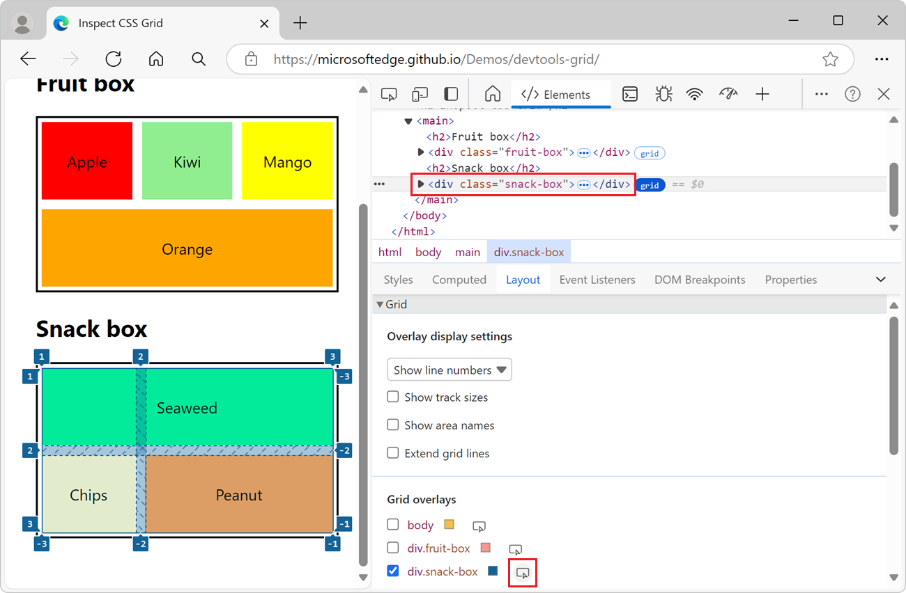

# Inspect CSS Grid

This article walks you through identifying CSS grids on a website and debugging grid layout issues using customizable grid overlays.

This article uses the [Inspect CSS Grid](https://microsoftedge.github.io/Demos/devtools-grid/) demo webpage.

<!-- ====================================================================== -->
## Before you begin

CSS Grid is a powerful layout paradigm for the web.  A good webpage to learn about CSS Grid and its features is [CSS grid layout](https://developer.mozilla.org/docs/Web/CSS/CSS_Grid_Layout) at MDN.

<!-- ====================================================================== -->
## Discover CSS grids

When an HTML element in your webpage has `display: grid` or `display: inline-grid` applied to it, a **grid** badge is displayed next to it in the **Elements** tool:

Click the **grid** badge next to an element to display a grid overlay over that element in the rendered webpage.  The overlay appears over the element, and shows the position of the grid lines and tracks:

When grids are included on a webpage, the **Layout** pane in the **Elements** tool includes a **Grid** section that lists the grid containers:

Use the **Grid** section to configure which information to display in grid overlays on the rendered webpage.  The **Grid** section in the **Layout** pane contains the following subsections:

| Subsection | Purpose |
| --- | --- |
| **Overlay display settings** | Configures which information is displayed in the grid overlay. |
| **Grid overlays** | Shows or hides the grid overlay for each grid container that's present on the webpage, and temporarily highlights a grid in the webpage. |

<!-- ====================================================================== -->
## Overlay display settings

In the **Layout** pane, in the expandable **Grid** section, the **Overlay display settings** section contains the following UI.

<!-- ------------------------------ -->
#### Dropdown list

Select one of the following options from the dropdown list:

| List item | Description |
|:--- |:--- |
| **Hide line labels** | Hides the labels of the lines for each grid overlay. |
| **Show line numbers** | Displays the numbers of the lines for each grid overlay.  Selected by default. |
| **Show line names** | Displays the names of the lines for each grid overlay when names are provided. |

The following sections explain the **Overlay display settings** dropdown list commands.

<!-- ---------- -->
###### Hide line labels

In the dropdown list, select **Hide line labels** to hide the labels of the lines for each grid overlay:

<!-- ---------- -->
###### Show line numbers

In the dropdown list, select **Show line numbers** to display the numbers of the lines for each grid overlay (selected by default):

By default, the positive and negative line numbers are displayed on the grid overlay.  For information about negative numbers in the grid overlay, see [Counting backwards](https://developer.mozilla.org/docs/Web/CSS/CSS_grid_layout/Grid_layout_using_line-based_placement#counting_backwards) in _Grid layout using line-based placement_ at MDN.

<!-- ---------- -->
###### Show line names

In the dropdown list, select **Show line names** to view the line names instead of numbers; this displays the names of the lines for each grid overlay when names are provided:

In the above example, 4 lines have names: `left`, `middle1`, `middle2`, and `right`.

For more information about line names in the grid overlay, see [Layout using named grid lines](https://developer.mozilla.org/docs/Web/CSS/CSS_Grid_Layout/Layout_using_Named_Grid_Lines) at MDN.

<!--In the demo, **orange** element spans from left to right, with `grid-column: left` and `grid-column: right` CSS.  Showing line names makes it easier to visualize the start and end position of the element.  -->

<!-- ------------------------------ -->
#### Checkboxes

The **Overlay display settings** section within the **Grid** section in the **Layout** pane contains the following checkboxes:

| Checkbox | Description |
|:--- |:--- |
| **Show track sizes**  | Displays or hides the sizes of the tracks. |
| **Show area names** | Displays or hides the names of the area, when names are provided. |
| **Extend grid lines** | Displays or hides the extensions of the grid dimensions along each axis.  By default, grid lines are only shown inside the element with `display: grid` or `display: inline-grid` CSS set on it. |

The following sections explain these checkboxes.

<!-- ---------- -->
###### Show track sizes

To view the track sizes of the grid, select the **Show track sizes** checkbox:

The `[authored size]` and `[computed size]` are then displayed in each line label.

| Size | Details |
|:--- |:--- |
| **authored size** | The size defined in stylesheet (omitted if not defined). |
| **computed size** | The actual size on screen. |

In the demo, the `snack-box` column sizes are defined in the `grid-template-columns:1fr 2fr;` CSS.  Therefore, the column line labels display both authored and computed sizes:

| Track size | Authored size | Computed size |
|:--- |:--- |:--- |
| **1fr** &#x2022; **96.66px** | 1fr | 96.66px |
| **2fr** &#x2022; **193.32px** | 2fr | 193.32px |

The line labels on the rows display only computed sizes, since there are no row sizes defined in the stylesheet:

| Track size | Authored size | Computed size |
|:--- |:--- |:--- |
| **40px** | &nbsp;| 40px |
| **40px** | &nbsp;| 40px |

<!-- ---------- -->
###### Show area names

To view the area names, select the **Show area names** checkbox:

In the above example, there are 3 areas in the grid: **top**, **bottom1** and **bottom2**.

<!-- ---------- -->
###### Extend grid lines

To extend the grid lines to the edge of the viewport along each axis, select the **Extend grid lines** checkbox:

<!-- ====================================================================== -->
## Grid overlays

The **Grid overlays** section contains a list of grids that are present on the webpage, each with a checkbox, along with various options.

<!-- ------------------------------ -->
#### Enable overlay views of multiple grids

To display the overlay grid for multiple grids, select the checkbox next to each name of the grid:

In the above example, there are three grid overlays enabled, each grid represented with a different color in the rendered webpage:

*  `body` - the gold grid overlay.
*  `div.fruit-box` - the pink grid overlay.
*  `div.snack-box` - the blue grid overlay.

<!-- ------------------------------ -->
#### Customize the grid overlay color

To open the color picker and customize the grid overlay color, click the box next to the name of the grid overlay:

<!-- ------------------------------ -->
#### Highlight the grid element in the DOM tree and webpage

To scroll to a grid layout in the rendered webpage and highlight the element that has the grid for a few seconds, as well as putting focus on the element with the grid layout in the DOM tree:

* In the **Grid overlays** section, click the **Show element in the Elements panel** () button next to the grid:

This works regardless of whether the grid's checkbox is selected or cleared.

<!-- ====================================================================== -->
## See also
<!-- all links in article, in order of article: -->

Demo webpages:
* [Inspect CSS Grid](https://microsoftedge.github.io/Demos/devtools-grid/)

MDN:
* [CSS grid layout](https://developer.mozilla.org/docs/Web/CSS/CSS_Grid_Layout)
   * [Grid layout using line-based placement](https://developer.mozilla.org/docs/Web/CSS/CSS_Grid_Layout/Line-based_Placement_with_CSS_Grid)
   * [Layout using named grid lines](https://developer.mozilla.org/docs/Web/CSS/CSS_Grid_Layout/Layout_using_Named_Grid_Lines)

<!-- ====================================================================== -->
> [!NOTE]
> Portions of this page are modifications based on work created and [shared by Google](https://developers.google.com/terms/site-policies) and used according to terms described in the [Creative Commons Attribution 4.0 International License](https://creativecommons.org/licenses/by/4.0).
> The original page is found [here](https://developer.chrome.com/docs/devtools/css/grid/) and is authored by [Jecelyn Yeen](https://developers.google.com/web/resources/contributors#jecelyn-yeen) (Developer advocate, Chrome DevTools).

This work is licensed under a [Creative Commons Attribution 4.0 International License](https://creativecommons.org/licenses/by/4.0).
