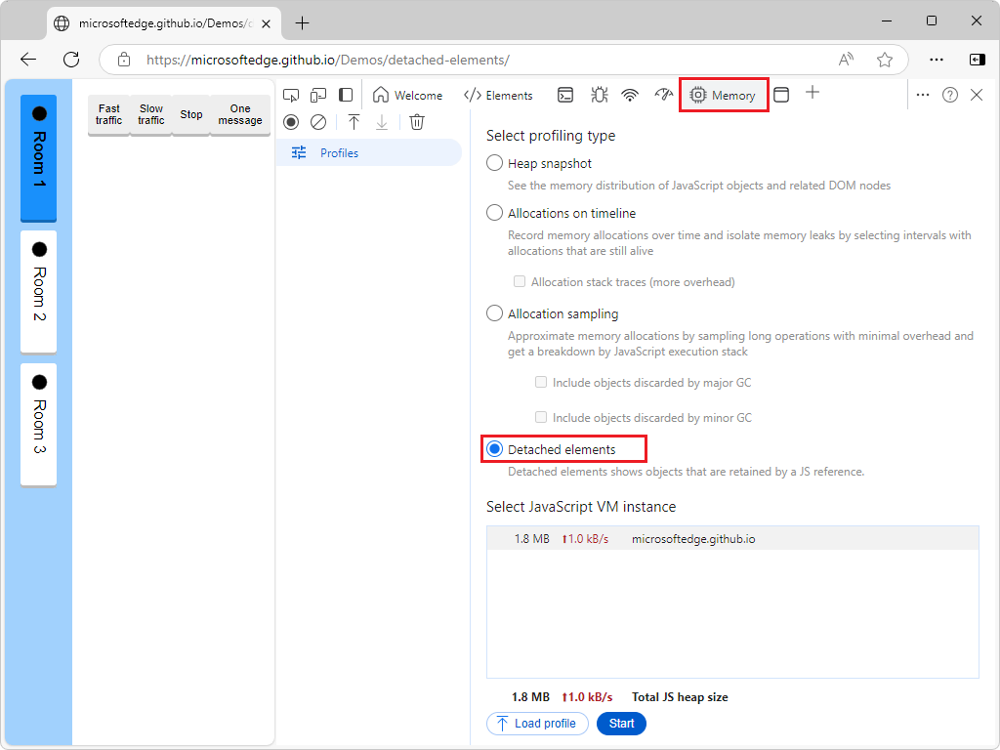
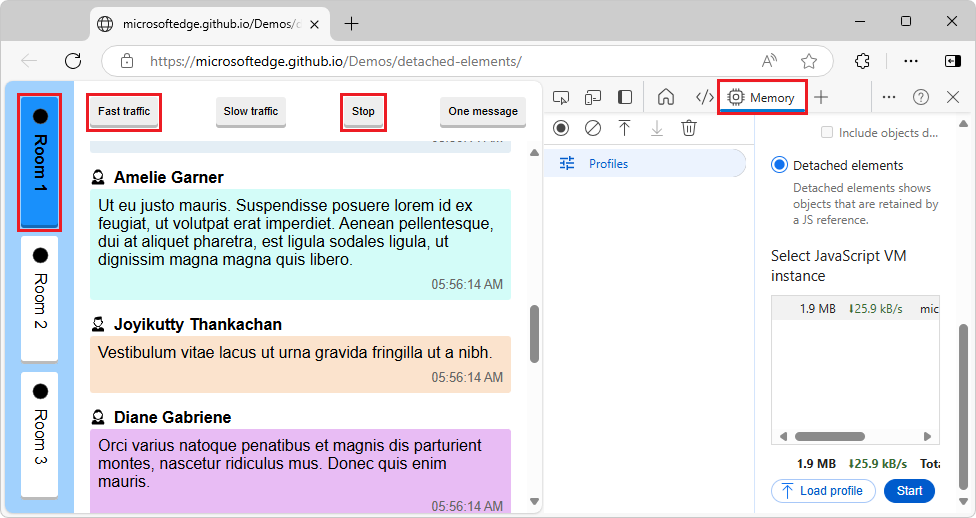
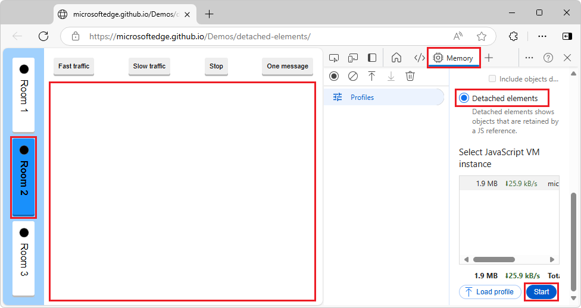
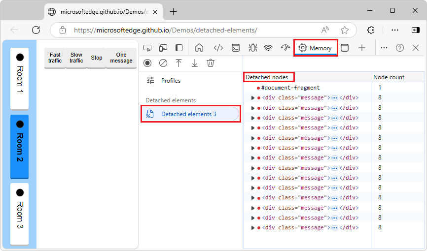
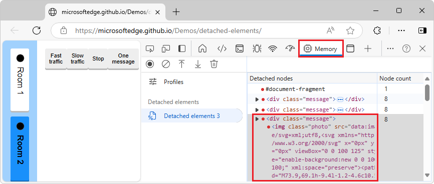

# Debug DOM memory leaks by using the Detached Elements profiling type

One way to find and display all of the detached elements on a webpage is to use the **Memory** tool's **Detached elements** option button (profiling type), as follows.  For a comparison of tools to view detached elements, see [Tools for investigating detached elements](./index.md#tools-for-investigating-detached-elements) in _Fix memory problems_.

The **Detached elements** option button (profiling type) helps you fix memory leaks due to detached DOM elements.  The resulting profile lists the detached objects that are retained by a JavaScript reference.  This profiling type shows a view of the detached nodes to help you identify memory leaks on your webpage.

To use the **Detached elements** option button (profiling type) to analyze a webpage's detached elements:

1. Open a webpage, such as the [Detached Elements demo webpage](https://microsoftedge.github.io/Demos/detached-elements/), in a new window or tab.

1. Right-click the webpage, and then select **Inspect**.  Or, press **Ctrl+Shift+I** (Windows, Linux) or **Command+Option+I** (macOS).

   DevTools opens.

1. In DevTools, in the **Activity Bar**, click the **Memory** tab ().

   If that tab isn't visible, click the **More Tools** () button, and then select **Memory**.  The **Memory** tool opens:

   

   If the **Detached elements** option button (profiling type) isn't shown, because a profile is already displayed, in the upper left, click **Profiles** ().

   You don't need to select the **Detached elements** option button (profiling type) at this point, because the webpage hasn't generated any detached elements yet.

   <!-- ------------------------------ -->
   **Generate elements used by an instance of the Room class:**

   The **Room 1** button is initially selected, corresponding to the Room 1 instance of the `Room` class.

1. In the demo webpage, click the **Fast traffic** button.

   The demo webpage begins generating messages and displaying them in the webpage:

   

1. After some messages are displayed, click the **Stop** button in the demo webpage.

   Each message is a `
` element that's referenced by the Room 1 instance of the `Room` class.  There are no detached elements in the webpage DOM tree, because all of the message elements are attached to the present, Room 1 instance of the **Room** class.

   <!-- ------------------------------ -->
   **Change to a different instance of the Room class, so elements become detached:**

1. In the demo webpage, click the **Room 2** button, which corresponds to the Room 2 instance of the `Room` class.

   In the webpage, the messages disappear:

   

   The messages that were generated for the Room 1 instance of the **Room** class (`
` elements) are no longer attached to the DOM, but they're still referenced by the Room 1 instance of the **Room** class.  They are detached elements, which are a memory leak, unless they are going to be used again by the webpage.

   <!-- ------------------------------ -->
   **Get the list of detached elements:**

1. In DevTools, in the **Memory** tool, select the **Detached elements** option button (profiling type), and then click the **Start** button.

   The list of detached nodes is displayed in the **Detached nodes** column of the generated **Detached elements** profile:

   

   The detached elements are displayed, as DOM nodes like in the DOM tree in the **Elements** tool.  In the **Profiles** list, in the **Detached elements** section, the profile is listed.

1. Expand a DOM node to display its child elements (DOM nodes):

   

   These detached elements (DOM nodes) are memory leaks, if they aren't going to be reused by the application.

If you want to return to the list of option buttons for profiling types, in the upper left of the **Memory** tool, click **Profiles** ().

For additional ways to assess memory leaks, see [Tools for investigating detached elements](./index.md#tools-for-investigating-detached-elements) in _Fix memory problems_.

<!-- ====================================================================== -->
## About DOM leaks due to detached elements

To increase the performance of your webpage, find detached elements that the browser can't garbage-collect, and then locate the JavaScript object that's still referencing the detached element.  Then change your JavaScript to release the element, to reduce the number of detached elements on your webpage, increasing webpage performance and responsiveness.
<!-- copied from dom-leaks.md -->

<!-- copied from dom-leaks.md -->
<!-- ------------------------------ -->
#### Fixing the JavaScript code to prevent detached elements that can't be garbage-collected

In the demo webpage, the `collectOldMessages` method of the `Room` class (on line 26) contains comments about a potential leak, and recommends making a single cache for all `Room` instances, instead of a cache for each `Room` instance, and then monitoring how many elements get into that cache over time.

There is a potential leak in the existing code, because the cleanup in this method occurs at a different rate than the addition of new messages.  We can easily find ourselves in a situation where we have messages in the cache that don't need (or can't) be reused right away.  This is not likely to become too much, but the cache is per-room, which multiplies the problem.

<!-- copied from dom-leaks.md, & trimmed to omit DE tool's UI controls -->
<!-- ====================================================================== -->
## About detached elements and memory leaks

Detached elements aren't always an indication of a memory leak, and memory leaks aren't always caused by detached elements.  Memory leaks depend on the context of your application.

A memory leak can occur in your application when an element is no longer attached to the Document Object Model (DOM) tree, but is still referenced by some JavaScript running on the webpage. These elements are called *detached elements*.  For the browser to garbage-collect (GC) the detached element, the element must not be referenced from the DOM tree or from JavaScript code.

Memory issues affect webpage performance, including memory leaks, memory bloat, and frequent garbage collections.  Symptoms for your users include:

*  The performance of a webpage gets progressively worse over time.
*  The performance of a webpage is consistently bad.
*  The performance of a webpage is delayed or appears to pause frequently.

<!-- copied (& trimmed) from dom-leaks.md -->
<!-- ====================================================================== -->
## Re-attaching elements

For this demo webpage, it makes sense to retain the list of chat messages, so that if a user switches back to **Room 1**, the message log is preserved.  Similarly, a feed in social media might detach elements as users scroll past them, and reattach them to the DOM when users scroll back up.

<!-- copied from dom-leaks.md -->
<!-- ====================================================================== -->
## Long-running apps and unmounting components

Be sure to unmount components.  For long-running apps, small memory leaks of only a few kilobytes can noticeably degrade performance over time.  For webpages that use the React framework, React maintains a virtualized copy of the DOM.  Failing to properly unmount components can potentially lead to an application leaking large parts of the virtual DOM.

<!-- ====================================================================== -->
## See also

* [Tools for investigating detached elements](./index.md#tools-for-investigating-detached-elements) in _Fix memory problems_.
* [Detached Elements demo webpage](https://microsoftedge.github.io/Demos/detached-elements/)
   * [MicrosoftEdge/Demos > detached-elements](https://github.com/MicrosoftEdge/Demos/tree/main/detached-elements) repo folder - source code.<!-- link not in article -->
* [Detached Elements profiling type in Memory tool](../whats-new/2024/10/devtools-130.md#detached-elements-profiling-type-in-memory-tool) in _What's New in DevTools (Microsoft Edge 130)_.
