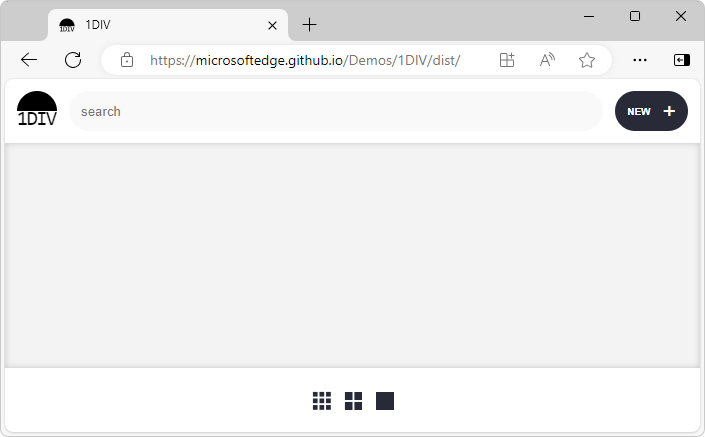
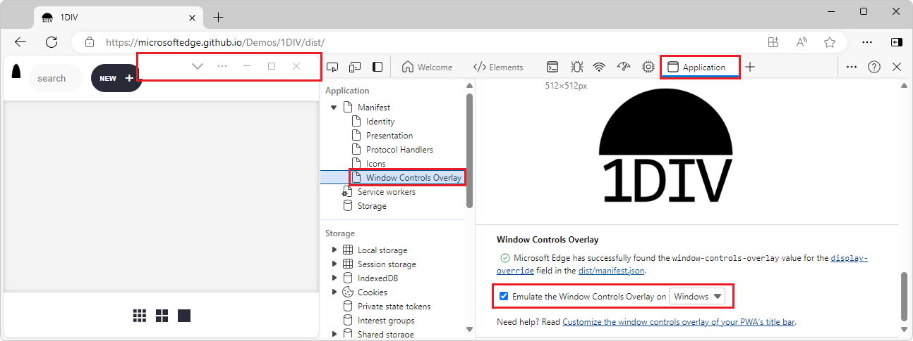

# Simulate a Window Controls Overlay in a PWA's title bar area

In DevTools, in the **Application** tool, you can simulate the Window Controls Overlay (WCO) feature that Progressive Web Apps (PWAs) have, without having to install the PWA first and enable the WCO feature.  By simulating the WCO feature from within DevTools, you can test your title bar area's CSS code changes more quickly.

<!-- ====================================================================== -->
## Using the WCO feature in your PWA

In your Progressive Web App (PWA), use the Window Controls Overlay (WCO) to have control over the title bar area that's currently displayed in standalone display mode.  Window Controls Overlay is a set of features that work together to provide just the essential controls needed for the app window.  This layout frees up more space for the web content layer.

Use the **Window Controls Overlay** section to emulate window controls for Windows, Linux, and macOS.

For more information about the Window Controls Overlay, see [Display content in the title bar area using Window Controls Overlay](../../progressive-web-apps-chromium/how-to/window-controls-overlay.md).

<!-- ====================================================================== -->
## Simulate the Window Controls Overlay in DevTools

1. Open a Progressive Web App (PWA) that uses the Window Controls Overlay (WCO) feature.  For example, open the [1DIV demo app](https://microsoftedge.github.io/Demos/1DIV/dist/) in a new window or tab:

   

   The Window Controls Overlay is not yet displayed in the upper right of the webpage.

1. Right-click the webpage, and then select **Inspect**.  Or, press **Ctrl+Shift+I** (Windows, Linux) or **Command+Option+I** (macOS).  DevTools opens.

1. On the **Activity Bar**, select the **Application** tab.  If that tab isn't visible, click the **More tools** () button, and then select **Application**.

1. In the **Application** tool, expand **Manifest** in the upper left, and then select **Window Controls Overlay**.

1. In the **Window Controls Overlay** section on the right, select the checkbox **Emulate the Window Controls Overlay on** \<platform\>, and then select a platform, such as Windows, macOS, or Linux.

   The simulated Window Controls Overlay is added to the rendered web page: 

   

   The simulated overlay is a static image of window controls.  The values of the CSS variables `env(titlebar-area-left)`, `env(titlebar-area-top)`, `env(titlebar-area-width)`, and `env(titlebar-area-height)` are set to match the platform that you selected.

For more information about using the Window Controls Overlay in a Progressive Web App, see [Display content in the title bar area using Window Controls Overlay](../../progressive-web-apps-chromium/how-to/window-controls-overlay.md).

<!-- ====================================================================== -->
## See also

* [Display content in the title bar area using Window Controls Overlay](../../progressive-web-apps-chromium/how-to/window-controls-overlay.md) - the Window Controls Overlay feature for PWAs.
* [Tooling for PWA Window Controls Overlay](../whats-new/2024/01/devtools-121.md#tooling-for-pwa-window-controls-overlay) in _What's New in DevTools (Microsoft Edge 121)_.
