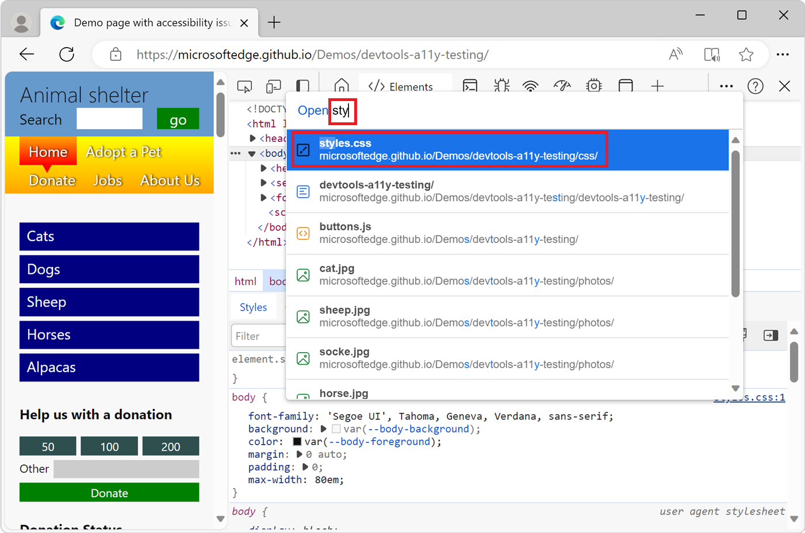
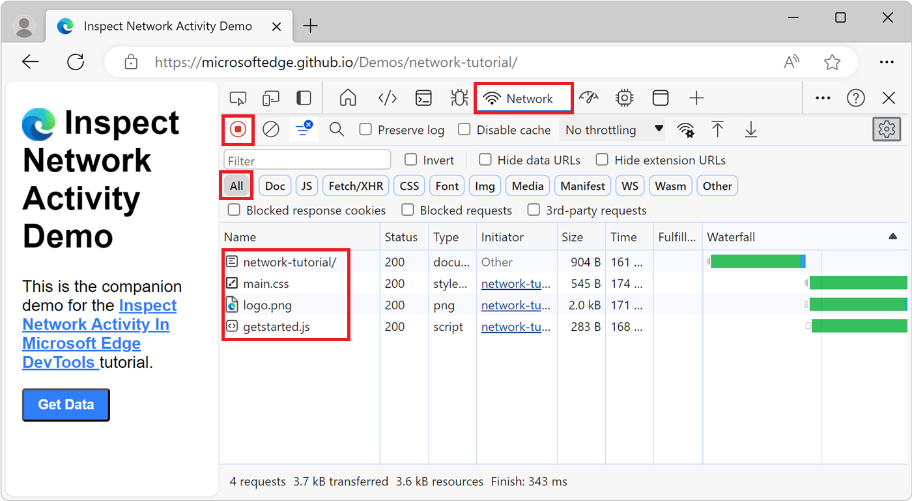
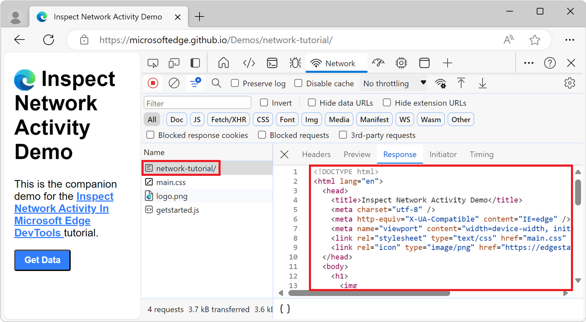
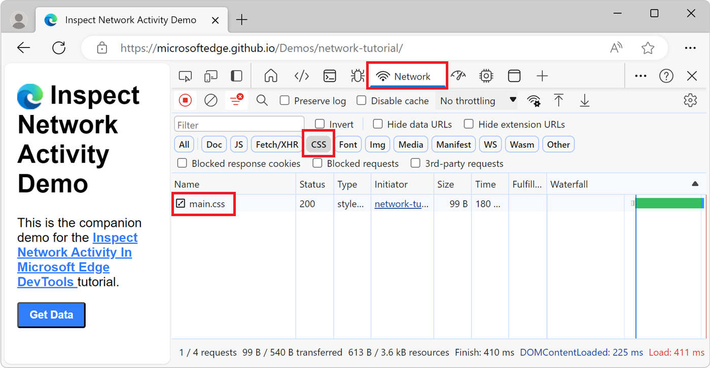
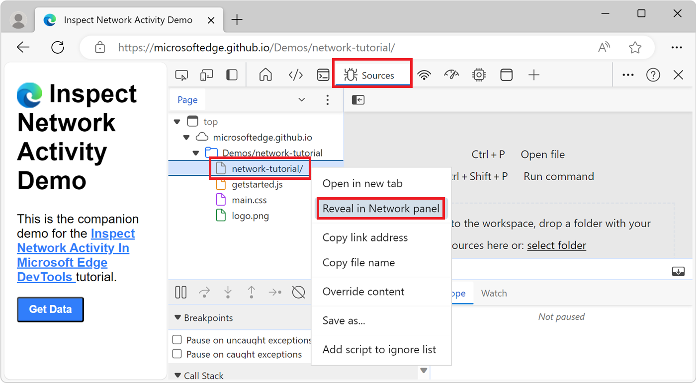
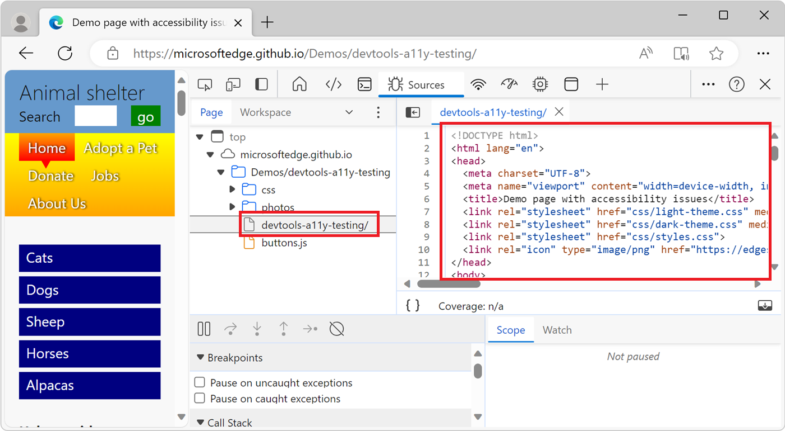
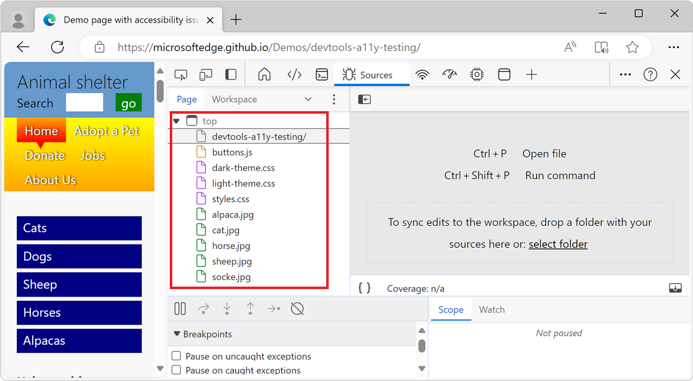
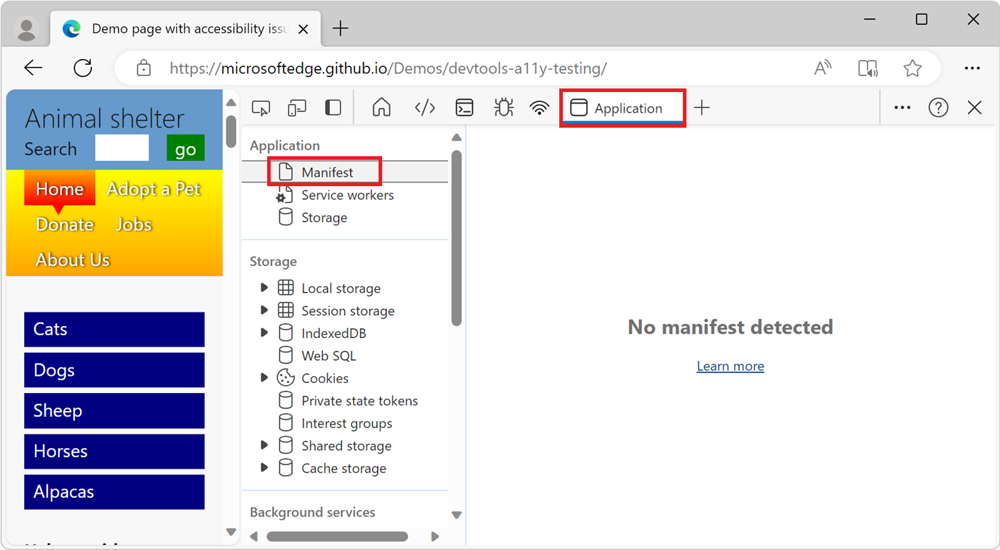
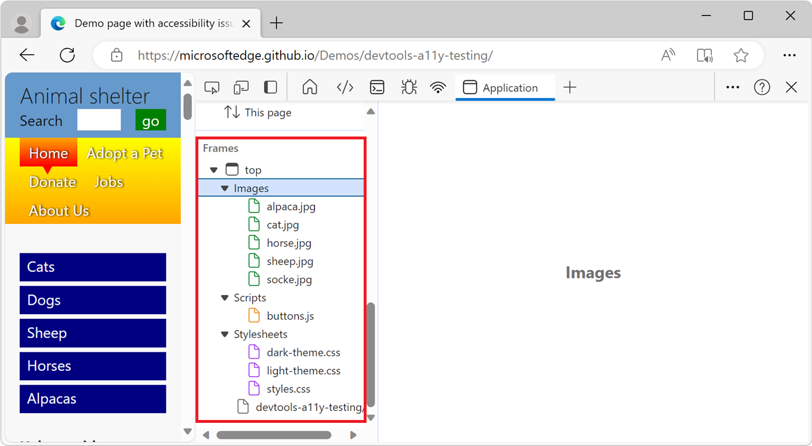
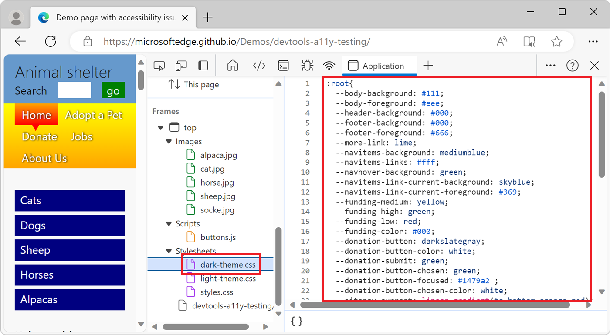

<!-- Copyright Kayce Basques

   Licensed under the Apache License, Version 2.0 (the "License");
   you may not use this file except in compliance with the License.
   You may obtain a copy of the License at

       https://www.apache.org/licenses/LICENSE-2.0

   Unless required by applicable law or agreed to in writing, software
   distributed under the License is distributed on an "AS IS" BASIS,
   WITHOUT WARRANTIES OR CONDITIONS OF ANY KIND, either express or implied.
   See the License for the specific language governing permissions and
   limitations under the License.  -->
# View the resource files that make up a webpage

You can view the resources that make up a web page from within several tools (or _panels_) in Microsoft Edge DevTools, including:
*  **Network** tool
*  **Sources** tool
*  **Application** tool

Resources are the files that make up a webpage.  Examples of resources include:
*  CSS files
*  JavaScript files
*  HTML files
*  Image files

See also:
*  [Learn web development](https://developer.mozilla.org/docs/Learn) at Mozilla.org
*  [Overview of DevTools](../../devtools-guide/overview.md)

<!-- ====================================================================== -->
## Open resource files from the Command Menu

When you know the name of a webpage's resource file that you want to inspect, the **Command Menu** in DevTools provides a fast way of finding and opening that resource.

1. In a new window or tab, go to a webpage, such as the [Accessibility-testing features demo](https://microsoftedge.github.io/Demos/devtools-a11y-testing/).  (The source files for that webpage are at [MicrosoftEdge / Demos > devtools-a11y-testing](https://github.com/MicrosoftEdge/Demos/tree/main/devtools-a11y-testing).)

1. To open DevTools, right-click the webpage, and then select **Inspect**. Or press **Ctrl+Shift+I** (Windows, Linux) or **Command+Option+I** (macOS).

1. When DevTools has focus, press **Ctrl+P** (Windows, Linux) or **Command+P** (macOS). Or, click the **Customize and control DevTools** () button in DevTools and then select **Open file**.  The Command Menu opens, displaying the **Open File** list:

   

1. If there's a greater-than (>) prompt, press **Backspace** to get to the **Open File** prompt.

1. Start typing the file name, and then press **Enter** when the correct file is highlighted in the autocomplete box, or select the file from the dropdown list:

   

<!-- ====================================================================== -->
## Browse resource files in the Network tool

In the **Network** tool, you can inspect the resource files that make up the current webpage, such as `.html`, `.css`, `.js`, and image files.  To learn how to get the details for a specific resource, see [Inspect the details of the resource](../network/index.md#inspect-the-details-of-the-resource) in _Inspect network activity_.

1. In a new window or tab, go to a webpage, such as the [Inspect Network Activity Demo](https://microsoftedge.github.io/Demos/network-tutorial/).  (The source files for that webpage are at [MicrosoftEdge / Demos > network-tutorial](https://github.com/MicrosoftEdge/Demos/tree/main/network-tutorial).)

1. To open DevTools, right-click the webpage, and then select **Inspect**.  Or, press **Ctrl+Shift+I** (Windows, Linux) or **Command+Option+I** (macOS).  DevTools opens.

1. In DevTools, on the **Activity Bar**, select the **Network** tab.  If that tab isn't visible, click the **More Tools** () button.

1. Make sure the **Record network log** button in the upper left is selected (red).

1. Refresh the page.  By default, the **All** filter button is selected, so all the webpage's resource files are listed in the **Network** tool, one row per resource file:

   

1. Select a resource to view it.  For example, select the `network-tutorial` path to display `index.html`:

   

To learn more about how to show the network activity that's generated by the page resources, see [Log network activity](../network/index.md#log-network-activity) in the article  _Inspect network activity_.

<!-- ====================================================================== -->
## Browse resource files by file type by filtering in the Network tool

In the **Network** tool, when you view the list of resource files that make up the current webpage, you can filter which type of resources to list, such as only showing `.css` or `.js` files.

For example, to only display CSS files:

1. In a new window or tab, go to a webpage, such as the [Inspect Network Activity Demo](https://microsoftedge.github.io/Demos/network-tutorial/).  (The source files for that webpage are at [MicrosoftEdge / Demos > network-tutorial](https://github.com/MicrosoftEdge/Demos/tree/main/network-tutorial).)

1. To open DevTools, right-click the webpage, and then select **Inspect**.  Or, press **Ctrl+Shift+I** (Windows, Linux) or **Command+Option+I** (macOS).  DevTools opens.

1. In DevTools, on the **Activity Bar**, select the **Network** tab.  If that tab isn't visible, click the **More Tools** () button.

1. Refresh the page.  By default, the **All** filter button is selected, so all the webpage's resource files are listed in the **Network** tool.

1. Click **CSS** to filter and only display CSS files. Only the `main.css` file is listed:

   

For more information, see [Filter by resource type](../network/index.md#filter-by-resource-type) in _Inspect network activity_.

<!-- ====================================================================== -->
## Show resource files in the Network tool from other tools

In various tools that list resource files for the webpage, to inspect a resource file in the **Network** tool, right-click the resource file and then select **Reveal in Network panel**.  You may need to first refresh the webpage while the **Network** tool is open.

For example, to go from the **Page** tab's resource list in the **Sources** tool to the **Network** tool:

1. In a new window or tab, go to a webpage, such as the [Inspect Network Activity Demo](https://microsoftedge.github.io/Demos/network-tutorial/).  (The source files for that webpage are at [MicrosoftEdge / Demos > network-tutorial](https://github.com/MicrosoftEdge/Demos/tree/main/network-tutorial).)

1. To open DevTools, right-click the webpage, and then select **Inspect**.  Or, press **Ctrl+Shift+I** (Windows, Linux) or **Command+Option+I** (macOS).  DevTools opens.

1. In DevTools, on the **Activity Bar**, select the **Network** tab.  If that tab isn't visible, click the **More Tools** () button.

1. Press **Ctrl+R** to refresh the page.  The received resource files that make up the webpage are now added as rows in the **Network** tab.  The **network-tutorial/** folder row represents the HTML page - in this case, [index.html](https://github.com/MicrosoftEdge/Demos/tree/main/network-tutoriql).

1. In DevTools, on the **Activity Bar**, click the **Sources** tab.

1. In the **Page** tab in the upper left, right-click a resource file, and then select **Reveal in Network panel**:

   

   If the **Reveal in Network panel** menuitem isn't listed, go to the **Network** tool, make sure the **Record network log** button in the upper left is selected (red), and then refresh the page.

<!-- ====================================================================== -->
## Browse resource files by folder in the Page tab of the Sources tool

You can use the **Sources** tool to view the webpage's resource files organized by directory, as follows:

1. To open DevTools, right-click the webpage, and then select **Inspect**.  Or, press **Ctrl+Shift+I** (Windows, Linux) or **Command+Option+I** (macOS).  DevTools opens.

1. In DevTools, on the **Activity Bar**, select the **Sources** tab.  If that tab isn't visible, click the **More tools** () button.

1. In the **Navigator** pane in the upper left, select the **Page** tab.

1. By default, resource files are grouped by folder.  If the resources are all listed alphabetically by file name instead, click the **More options** () button to the right of the **Page** tab, and then select **Group by folder**:

   

    The **Page** tab contains various node types, including:

    | Page item | Description |
    |---|---|
    | `top` | The main document _browsing context_, such as a browser tab, a browser window, or a frame. See [Browsing context](https://developer.mozilla.org/docs/Glossary/Browsing_context) or [\<iframe\>: The Inline Frame element](https://developer.mozilla.org/docs/Web/HTML/Element/iframe). |
    | `microsoftedge.github.io` | The domain.  All resources nested under it come from that domain.  For example, the full URL of the `buttons.js` file is [https://microsoftedge.github.io/Demos/devtools-a11y-testing/buttons.js](https://microsoftedge.github.io/Demos/devtools-a11y-testing/buttons.js). |
    | `Demos/devtools-a11y-testing`, `css`, `photos` | Directories. |
    | `devtools-a11y-testing/` | The main HTML document. |
    | `buttons.js` | A script to handle button presses on the page. |

1. Select a resource file to view it in the Editor of the **Sources** tool:

   

<!-- ====================================================================== -->
## Browse resource files sorted by file name in the Page tab of the Sources tool

By default, the **Page** tab in the **Sources** tool groups resource files by folder.  To instead display all the resource files for each domain grouped together in a single alphabetized list:

1. In a new window or tab, go to a webpage, such as the [Accessibility-testing features demo](https://microsoftedge.github.io/Demos/devtools-a11y-testing/).  (The source files for that webpage are at [MicrosoftEdge / Demos > devtools-a11y-testing](https://github.com/MicrosoftEdge/Demos/tree/main/devtools-a11y-testing).)

1. To open DevTools, right-click the webpage, and then select **Inspect**.  Or, press **Ctrl+Shift+I** (Windows, Linux) or **Command+Option+I** (macOS).  DevTools opens.

1. In DevTools, on the **Activity Bar**, select the **Sources** tab.  If that tab isn't visible, click the **More tools** () button.

1. In the **Navigator** pane in the upper left, select the **Page** tab.

1. Click **More options** () and then clear the **Group by folder** option:

   

   All the resource files for each domain (such as **Top**) are grouped together in a single alphabetized list:

   

<!-- ====================================================================== -->
## Browse resource files by file type in the Frames tree in the Application tool

One way to view webpage resources grouped by file type is by using the **Frames** tree in the **Application** tool:

1. To open DevTools, right-click the webpage, and then select **Inspect**.  Or, press **Ctrl+Shift+I** (Windows, Linux) or **Command+Option+I** (macOS).  DevTools opens.

1. In DevTools, on the **Activity Bar**, select the **Application** tab.  If that tab isn't visible, click the **More Tools** () button.

   The **Application** tool opens and by default shows the **Manifest** pane first:
   
   

1. Scroll down to the **Frames** pane and then expand the folder that you're interested in:

   

1. Select a resource to view it in the **Application** tool:

   

<!-- ====================================================================== -->
> [!NOTE]
> Portions of this page are modifications based on work created and [shared by Google](https://developers.google.com/terms/site-policies) and used according to terms described in the [Creative Commons Attribution 4.0 International License](https://creativecommons.org/licenses/by/4.0).
> The original page is found [here](https://developer.chrome.com/docs/devtools/resources/) and is authored by [Kayce Basques](https://developers.google.com/web/resources/contributors#kayce-basques) (Technical Writer, Chrome DevTools \& Lighthouse).

This work is licensed under a [Creative Commons Attribution 4.0 International License](https://creativecommons.org/licenses/by/4.0).
