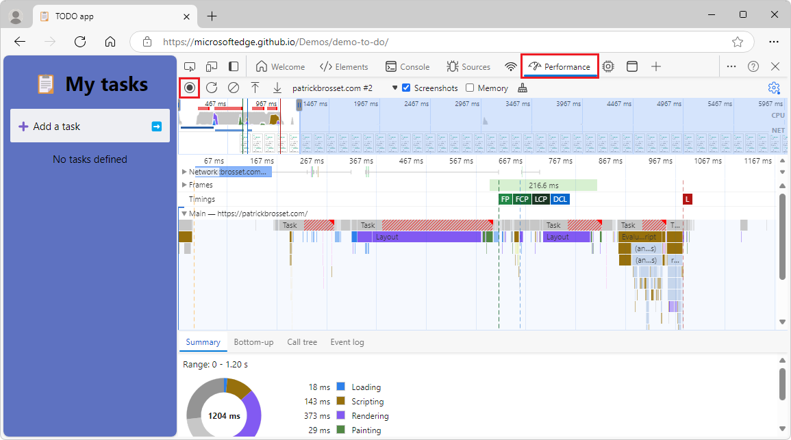
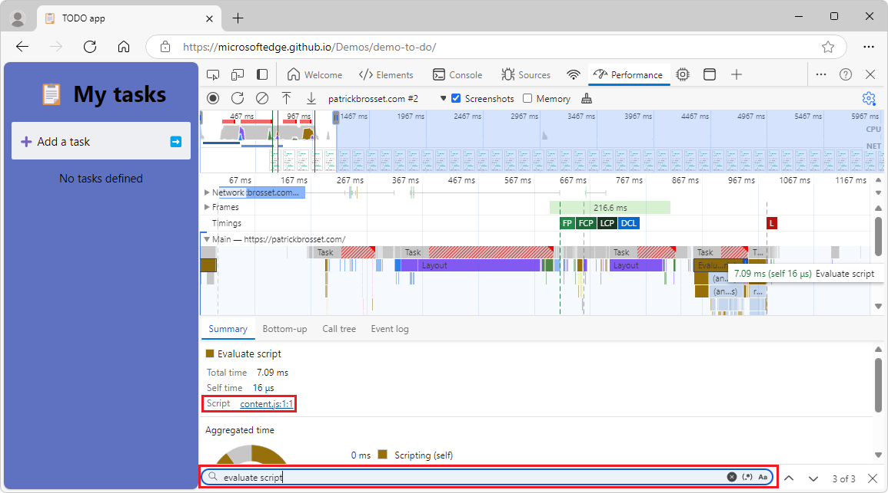
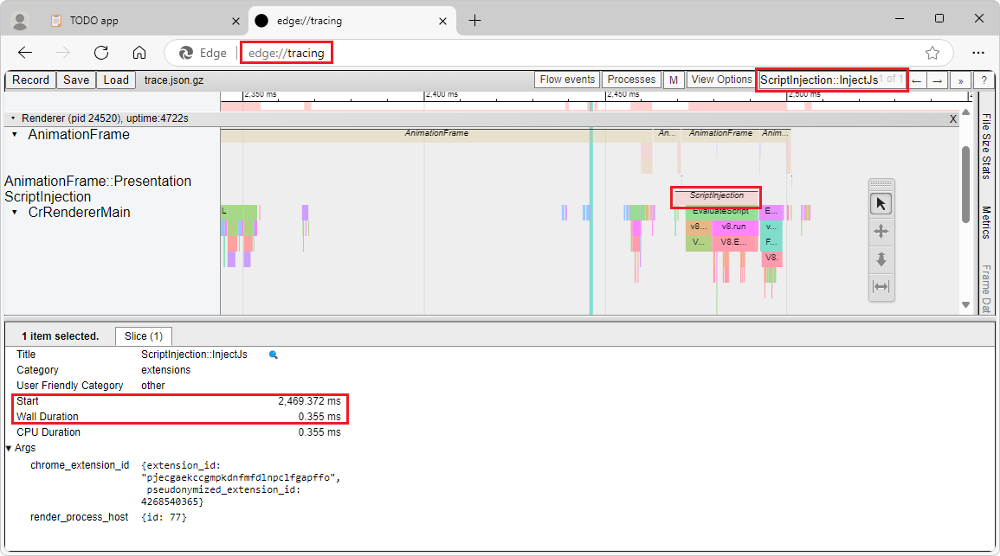

# Minimize an extension's impact on page load time

Content scripts are JavaScript files that your extension injects into webpages, and that run in the context of these webpages. Using content scripts, your extension can access and modify a rendered webpage by reading from or changing the DOM.

Content scripts can, however, have a noticeable impact on the performance of a webpage, for example by slowing down the page load time. This can happen if the content script runs a lot of code while the page is loading.

This article provides best practices that can help you minimize the performance impact of your extension on the webpages that your users visit.


<!-- ====================================================================== -->
## Profile your extension content script

To profile the performance of your extension's content script, use Microsoft Edge DevTools or the Edge tracing tool, as described in the following sections.


<!-- ------------------------------ -->
#### Profile your content script using Microsoft Edge DevTools

DevTools provides a set of features for inspecting, debugging, and profiling the code that a webpage uses. DevTools can also be used to profile your extension's code.

In this section, you'll learn how to use the **Performance** tool in DevTools to profile your extension's content script. To learn more about the **Performance** tool, see [Introduction to the Performance tool](../../devtools-guide-chromium/evaluate-performance/index.md).

1. To open DevTools, right-click the webpage, and then select **Inspect**.  Or, press **Ctrl+Shift+I** (Windows, Linux) or **Command+Option+I** (macOS).  DevTools opens.

1. In DevTools, on the **Activity Bar**, select the **Performance** () tab.  If that tab isn't visible, select **More tools** () > **Performance**.

1. To start recording a performance profile, click the **Record** () button.

1. Reload the page to capture the profiling data that corresponds to the page load time and then, once the page has finished loading, click the **Stop** () button to end the recording. DevTools displays the recorded performance profile.

   

1. To search for the performance events that are caused by your content script, press **Ctrl+F** on Windows/Linux or **Command+F** on macOS.  The **Find** text box appears at the bottom of the **Performance** tool.

1. Type **Evaluate script** and then press **Enter** until the **Performance** tool highlights the performance events that are caused by your content script.  You will know that you have found the right performance event when the **Script** label in the **Summary** panel shows the name of your content script.

   


<!-- ------------------------------ -->
#### Profile your content script using the Edge tracing tool

The Edge tracing tool, available at the `edge://tracing` URL, is a powerful tool that can provide detailed analysis of your extension's performance. In this section, you'll learn how to use the Edge tracing tool to understand the impact of your extension on the page load time. To learn more about this tracing tool, which is based on the **Perfetto** tool, see [Perfetto UI](https://perfetto.dev/docs/visualization/perfetto-ui) in the Perfetto Tracing Docs.

1. To open the Edge tracing tool, open a new tab or window, and go to `edge://tracing`. The tracing UI opens.

1. To start a new trace, in the top left corner of the tool, click the **Record** button. The **Record a new trace** dialog opens.

1. Select the **Manually select settings** option button. The list of categories appears.

1. To capture detailed information about your extension's content script compilation and execution, select all of the following categories:

   * **extensions**
   * **v8**
   * **devtools**
   * **devtools.timeline**

1. Click the **Record** button.  The dialog closes, and the Edge tracing tool starts recording the trace.

1. Open a new tab and load a webpage that your extension affects. The tracing tool collects data about the performance impact of your extension on the webpage.

1. Open the tab where the Edge tracing tool is running, and then click the **Stop** button. The new trace information appears in the tool.

Traces that are recorded by the Edge tracing tool provide a lot of information about the browser, as well as your extension webpage.

To filter the information to show only what's relevant to the webpage that your extension impacted:

1. In the `edge://tracing` page, press **Shift+Esc** to open the **Browser Task Manager** dialog.

1. In the **Browser Task Manager** dialog, search for the tab that corresponds to the webpage that your extension affected, and note the number in the **Process ID** column. Close the dialog.

1. In the toolbar of the Edge tracing tool, click **Processes**, and then select the checkbox that corresponds to the process ID you noted. Clear all other checkboxes.

1. In the upper right corner of the Edge tracing tool, click the search field, type **ScriptInjection::InjectJS**, and then press **Enter** repeatedly until an event that corresponds to your extension is highlighted in the bottom panel.

   The bottom panel displays the start time and total duration of the event:

   

To continue analyzing the performance impact of your extension's content script on the webpage, look for the following key events inside the **ScriptInjection::InjectJS** event:

* **v8.compile** - shows the compilation time of your content script.
* **v8.run** - indicates the running time of the compiled script.


<!-- ====================================================================== -->
## Only add content script code that's needed for the functionality of your extension

Your extension's content script runs in the context of the webpage. To minimize the impact of your content script on that webpage, make sure to only add, in your content script, the minimum amount of code that your extension needs to run in the context of the webpage. Audit the code in your content script and remove legacy frameworks, tools, libraries, or other code that aren't needed by your content script to run in Microsoft Edge.

You can make use of lazy loading and code splitting techniques to minimize the amount of code that runs in your content script:

* _Lazy loading_ is the process of loading is the process of loading your code only when it's needed, based on the user actions, the page content, or the extension logic.

* _Code splitting_ is the process of dividing your code into smaller chunks, or modules, which can be loaded separately or on demand.

If your extension is small enough, you won't need a build tool to split your code. If your extension is larger, and if your code is more complex to manage, use a build tool to split your code into smaller chunks. Build tools can help you organize your code into logical units, which can be loaded on demand. For example, you can use webpack to split your code into _entry points_ and _dynamic imports_:

* Entry points are loaded on every page load.

* Dynamic imports are only loaded on demand, such as when the user interacts with the webpage or with the extension's UI:

  ```javascript
  // When the user clicks on the page.
  document.addEventListener("click", async () => {
    // Dynamically load the code that's needed to handle the click event.
    const module = await import("chunk.js");
    // Do something with the newly loaded module code.
  });
  ```


<!-- ====================================================================== -->
## Only load your content script in required pages and frames

Your extension might not need to run on every webpage that the user visits. To reduce the amount of code that runs when webpages load, configure your extension to load content scripts only on the pages and frames where they are needed.

To configure the pages and frames where your content scripts are loaded, define URL patterns in your extension manifest file by using the `matches` property in the `content_scripts` section. To learn more, see [Inject scripts](https://developer.chrome.com/docs/extensions/develop/concepts/content-scripts#functionality) in _Content scripts_ in the Chrome Extensions documentation.

You can also use the `chrome.scripting` extensions API to programmatically inject your content script into the webpage. This API allows you to inject your content script based on the user's actions, the webpage content, or the extension logic. To learn more, see [chrome.scripting](https://developer.chrome.com/docs/extensions/reference/api/scripting) in the Chrome Extensions documentation.

Use the following best practices when configuring where your content scripts are loaded:

* Use the most specific URL patterns possible for the `matches` and `exclude_matches` properties in your extension manifest file. For example, if your content script only needs to run on webpages of the example.com domain, use `https://example.com/*` instead of "`*://*/*`.

* To control whether your content script only runs in the top-level frame, or also in nested frames of the webpage that matches a URL pattern, use the `all_frames` property in your extension manifest file. By default, this property is set to `false`, which means that your content script will only run in the top-level frame. If your content script needs to access or modify the DOM in nested frames, set this property to `true`. Note that setting `all_frames` to `true` increases the amount of code that runs on a webpage.


<!-- ====================================================================== -->
## Load content scripts only when needed

To reduce the amount of code that is loaded and that runs on each webpage, and to save memory and CPU resources, only load your content scripts when needed, instead of on every page load.


<!-- ------------------------------ -->
#### Configure when to load content scripts in your extension manifest file

To control when your extension's content script should be loaded, use the `run_at` property in your extension's manifest file.

By default, this property is set to the `document_idle` value, which means that the content script will be loaded, and run, after the page has finished loading and the DOM is ready. This is the recommended value for most content scripts. The `document_idle` value ensures that the content script will not interfere with the page loading process.

To load and run your content script before the page is fully loaded, use the `document_start` or `document_end` values. These values are useful in cases such as modifying the webpage layout or styling, but they can also cause performance issues or compatibility problems with other scripts on the page.


<!-- ------------------------------ -->
#### Programmatically load content scripts at runtime

To programmatically load your content scripts at runtime, only when needed, use the `chrome.scripting` API . The `chrome.scripting` API provides more control over when and where your content script is loaded.

For example, you can use the `chrome.scripting` API to load your content script only after the user has interacted with the webpage or extension UI, such as when clicking an extension's button, or clicking a part of the webpage.

If you use the `chrome.scripting` API when the user interacts with the webpage, make sure to carefully consider whether you need to repeatedly load your content script every time the interaction happens. Loading content scripts too frequently can cause user experience issues or errors.


<!-- ====================================================================== -->
## Avoid blocking calls or long-running synchronous tasks

Blocking calls and long-running synchronous tasks can delay the webpage load or make other aspects of a webpage slower, as well as negatively impact the UI responsiveness.

Blocking calls are JavaScript operations that prevent running other code until they complete. For example, using the `XMLHttpRequest`, `localStorage`, or `chrome.storage.sync` APIs (which are synchronous) prevents the webpage from running other code.

_Long-running synchronous tasks_ are synchronous tasks that take a long time to complete, preventing the browser from running other webpage code while they are running. This can include complex calculations, loops, or string manipulations.

Use asynchronous or non-blocking code, such as the Fetch API, JavaScript Promises, or Web Workers where possible. Asynchronous or non-blocking code allows the execution of other code while waiting for the completion of a task, without blocking the browser process that runs the webpage.

Note that, although using Web Workers to move your complex code logic to another thread is a good practice, it might still slow down devices that have a low CPU core count or that are already busy.

Below is an example using the Fetch API. While the data is being fetched, the browser is not blocked and can run other code:

```javascript
// Asynchronously load data from a JSON file.
fetch("data.json")
  .then(response => response.json())
  .then(data => {
    // Do something with the data.
  });
```


<!-- ------------------------------ -->
#### Asynchronously store data

To store data in your extension, use the `chrome.storage.local` API instead of the `localStorage` API, which is a synchronous API. The `chrome.storage.local` API is asynchronous and can store and retrieve data more efficiently, without affecting the performance of the webpage where your extension is running. For example, you can use the `chrome.storage.local.get` method to retrieve a previously stored value, and then use the result in a callback function:

```javascript
chrome.storage.local.get("key", result => {
  // Do something with the result.
});
```


<!-- ------------------------------ -->
#### Asynchronously send messages

To communicate from your content script to your extension's background page, or to other content scripts, use the `chrome.runtime.sendMessage` or `chrome.tabs.sendMessage` methods. These methods are asynchronous and non-blocking, and allow you to send and receive messages between the different parts of your extension. You can use promises or callbacks to handle the response of the messages. For example, you can use the `chrome.runtime.sendMessage` method to send a message to the background page, and then use the returned `Promise` object to process the response:

```javascript
chrome.runtime.sendMessage({type: 'request', data: 'some data'})
  .then(response => {
    // Do something with the response.
  });
```


<!-- ------------------------------ -->
#### Run intensive tasks off the main thread

Use Web Workers to run intensive tasks in your content script without blocking the thread that the browser uses to render the webpage. By using Web Workers, the code that runs the intensive tasks runs in a separate thread. Web Workers can improve the performance and responsiveness of your content script and of the webpages it runs on.

Note that creating a Web Worker creates a new thread, which uses new resources on the devices. Using too many resources on low-end devices might lead to performance issues.

To communicate between your content script and Web Worker, use the `postMessage` and `onmessage` APIs. For example, to create a new Web Worker and send a message to it, use the following code:

```javascript
// Create a new Web Worker.
cons worker = new Worker('worker.js');

// Send a message to the Web Worker.
worker.postMessage({type: 'task', data: 'some data'});
```

To receive messages in your Web Worker, and to send messages back:

```javascript
// Listen to messages that are sent to the Web Worker.
onmessage = event => {
  const type = event.data.type;
  const data = event.data.data;

  // Do something with the type and data
  // ...

  // Send a message back.
  postMessage({type: 'result', data: 'some result'});
};
```


<!-- ====================================================================== -->
## See also

* [Introduction to the Performance tool](../../devtools-guide-chromium/evaluate-performance/index.md)

Chrome Extension docs:
* [Manifest - content scripts](https://developer.chrome.com/docs/extensions/reference/manifest/content-scripts)
* [chrome.scripting](https://developer.chrome.com/docs/extensions/reference/api/scripting)
* [chrome.storage](https://developer.chrome.com/docs/extensions/reference/api/storage)

MDN:
* [Using Web Workers](https://developer.mozilla.org/docs/Web/API/Web_Workers_API/Using_web_workers)
