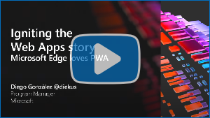

# Overview of Progressive Web Apps (PWAs)

Progressive Web Apps (PWAs) are applications that you build by using web technologies, and that can be installed and can run on all devices, from one codebase.

PWAs provide native-like experiences to your users on supporting devices. They adapt to the capabilities supported by each device and they can also run in web browsers, like websites.

To start building a PWA, see [Get started with Progressive Web Apps](./how-to/index.md).

<!-- ------------------------------ -->
#### Video: Ignite | March 2021 | Igniting the Web Apps Story

<!-- ====================================================================== -->
## PWA benefits

#### Native-like experiences

When installed on a device, PWAs function just like other apps. For example:

*  PWAs have their own application icons that can be added to a device's home screen or task bar.
*  PWAs can be launched automatically when an associated file type is opened.
*  PWAs can run when the user signs in.
*  PWAs can be submitted to application stores, such as the Microsoft Store.

#### Advanced capabilities

PWAs also have access to advanced capabilities. For example:

*  PWAs can continue working when the device is offline.
*  PWAs support push notifications.
*  PWAs can perform periodic updates even when the application is not running.
*  PWAs can access hardware features.

#### Web-related advantages

Finally, PWAs can run in web browsers, just like websites. Running like websites gives PWAs with advantages, such as:

*  PWAs can be indexed by search engines.
*  PWAs can be shared and launched from a standard web link.
*  PWAs are safe for users because they use secure HTTPS endpoints and other user safeguards.
*  PWAs adapt to the user's screen size or orientation, and input method.
*  PWAs can use advanced web APIs such as WebBluetooth, WebUSB, WebPayment, WebAuthn, or WebAssembly.

#### Lower development cost

PWAs have a **much lower cross-platform development cost** than compiled apps that require a specific, separate codebase for each platform, such as Android, iOS, and each desktop operating system.

With a PWA, you can use a single codebase that's shared between your website, mobile app, and desktop app (across operating systems).

<!-- ====================================================================== -->
## Cross-device compatibility

Progressive Web Apps (PWAs) are built using HTML, CSS, and JavaScript code that's hosted on web servers and that runs in web browser engines. They can either be used directly in a web browser, like a website, or installed on a device from an app store, or by using the app installation feature of a supporting browser. To learn more about installing PWAs in Microsoft Edge, see [Installing a PWA](./ux.md#installing-a-pwa).

The user experience of a PWA scales up or down with device capabilities. In particular, on Windows with Microsoft Edge, you can build immersive experiences that deeply integrate with the operating system. Using only web technologies ensures that your app will work on other browsers, operating systems, and devices.

Desktop computing continues to be the primary productivity environment for many users.  PWAs can provide fully tailored, installable experiences on a desktop operating system that inherit the benefits of that environment.  Yet PWAs can also be installed on mobile devices, or used directly in web browsers.

<!-- ====================================================================== -->
## Bridging the gap between web and native

There isn't much you can't do today with web technologies. Many features that were once only possible by using device-specific languages can now be achieved by using standard web technologies. For example:

*   Handle files.
*   Share content with other apps.
*   Access the clipboard.
*   Sync data and fetch resources in the background.
*   Access device hardware such as Bluetooth and USB.
*   Store content in databases.
*   Take advantage of hardware accelerated graphics.
*   Use CSS layouts, animations, and filters to create advanced designs.
*   Run near-compiled performance code with WebAssembly.

Thanks to Microsoft Edge, PWAs on desktop can take full advantage of these capabilities to deliver what users expect desktop apps to be able to do.  These capabilities provide more engaging experiences across web and desktop platforms.

To find examples of what PWAs can do, see [Myth Busting PWAs](https://www.davrous.com/2019/10/18/myth-busting-pwas-the-new-edge-edition).

<!-- ====================================================================== -->
## The Microsoft Store

Because Progressive Web Apps (PWAs) are just like other apps in the [Microsoft Store](https://www.microsoft.com/store/apps/windows), users can fully engage with them—from discovery, to installation, to execution—without<!-- em dashes--> ever opening the browser.

The Microsoft Store provides a trustworthy and familiar experience for users to install your app.  Additionally, you can view detailed usage statistics and charts that let you know how your apps in the Microsoft Store are doing.

See [Publish a Progressive Web App to the Microsoft Store](how-to/microsoft-store.md).

<!-- ====================================================================== -->
## Success stories

Using Progressive Web App (PWA) technologies is a great way to make your app **safe**, **discoverable**, **linkable**, **easy to install** and update, **responsive**, and **network independent**.  Many businesses have had success with PWAs.  For example:

*   The Starbucks PWA has increased daily active users twice.  Orders on desktop are nearly the same rate as mobile ([source](https://twitter.com/davidbrunelle/status/993960071406080000)).
*   Trivago saw an increase of 150% for people who add its PWA to the home screen.  The increased engagement led to a 97% increase in clockouts to hotel offers ([source](https://www.thinkwithgoogle.com/intl/en-gb/marketing-strategies/app-and-mobile/trivago-embrace-progressive-web-apps-as-the-future-of-mobile/)).
*   Tinder cut load times from 11.91 seconds to 4.68 seconds with their PWA.  The app is 90% smaller than the compiled Android app ([source](https://medium.com/@addyosmani/a-tinder-progressive-web-app-performance-case-study-78919d98ece0)).

Read more success stories on the [PWA Stats](https://www.pwastats.com/) website.

<!-- ====================================================================== -->
## See also

*  [Progressive Web Apps](https://developer.mozilla.org/docs/Web/Progressive_web_apps) at MDN Web Docs.
*  [Progressive Web Apps](https://web.dev/progressive-web-apps/) at web.dev.
*  [Progressive Web Apps](https://wikipedia.org/wiki/Progressive_web_app) at Wikipedia.
*  [PWA Q&A](https://www.aaron-gustafson.com/notebook/pwa-qa)
